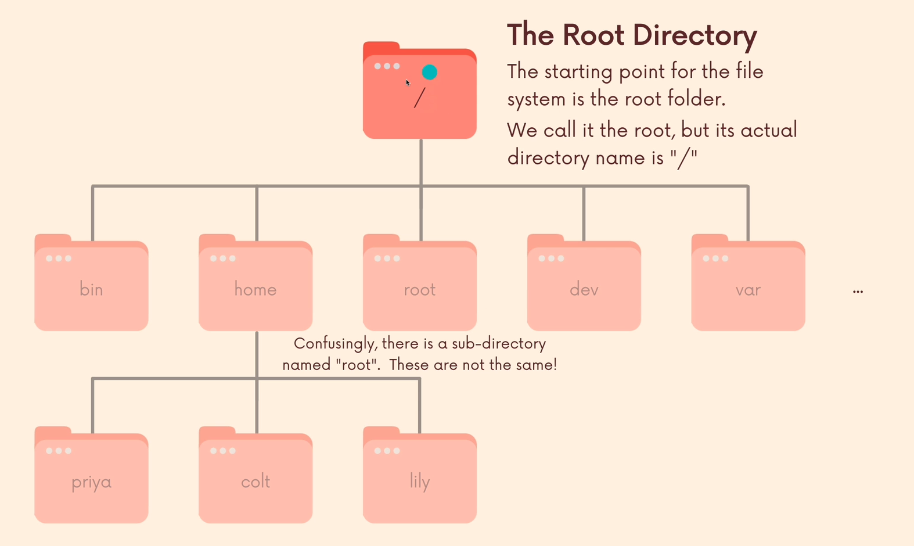

# Navigation

## Root Directory

It's the entry point of the OS file system
`/` --> Root directory

### Home Directory

`/home` contains a home folder for each user on the system.  
`~` --> Current logged in user's home directory

## Commands

Print current working directory  
`pwd`

List the contents of a directory  
`ls DIRECTORY`

Change working directory  
`cd DIRECTORY`

## Relative and Absolute paths

### Relative paths

Relative paths are paths that specify a directory/file relative to the current directory

### Absolute paths

Absolute paths are paths that start from the root directory with `/`

## File System

https://www.linuxfoundation.org/blog/blog/classic-sysadmin-the-linux-filesystem-explained

/bin
/boot
/dev
/etc
/home
/lib
/media
/mnt
/opt

### /bin

It is the directory that contains _binaries_: some of the applications and programs you can run.

### /boot

Files required for starting your system. Do not touch!

### /dev

Device files.

### /etc

It stands for "Everything to configure".  
System-wide configurations files.

### /hoome

User's personal directories

### /lib

Contains libraries. Libraries are files containing code that your applications can use.

### /usr

Contains a mish-mash of directories which in turn contain applications, libraries, documentation, wallpapers, icons and a long list of other stuff that need to be shared by applications and services.

### /media

Contains files of removable media: USB drivers, DVD's, SD cards, etc

### /var

Contains generated log files, caches and outputs

### /root

It's the home directory of the root user
