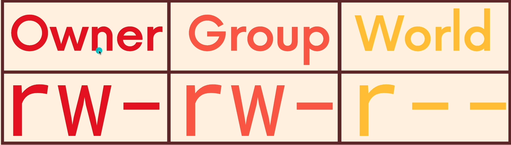
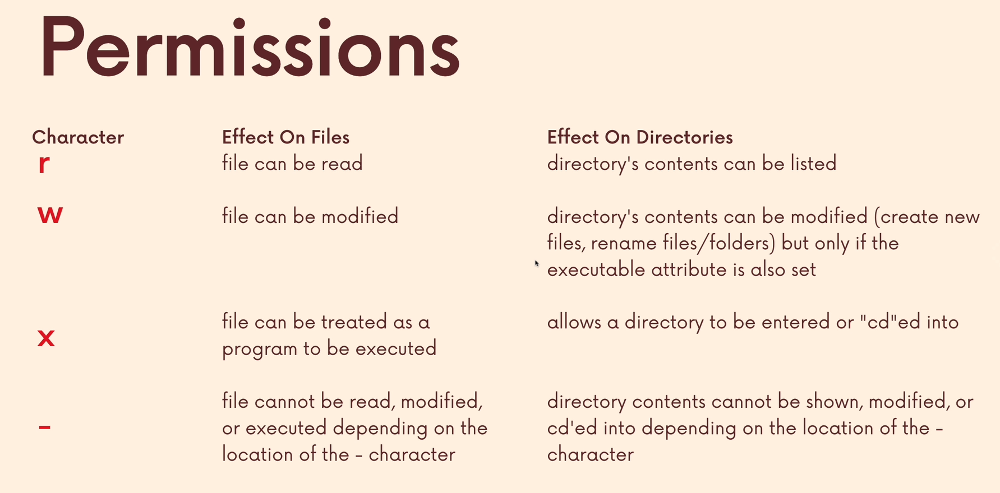

# Permissions basics

### Important

-   reading permission attributes
-   understanding read, write, and execute permissions
-   file owners and file group owners

## Multiple users

Unix and unix-like systems are multiuser operating systems

As regular users, we don't have permission to write or even read every file on the machine  
`cat /etc/sudoers` --> `Permission denied`

## Groups

On unix systems, a single user may be the owner of files and directories, meaning that they have control over their access

Users can belong to groups which are given access to particular files and folders by their owners

There's a owner and a group owner for a file. The owner is a single user and the group owner is a group of users, we can apply different permissions for these two categories

## File attributes

The weird looking 10 characters we see printed out first are the file attributes

These characters tell us the type of the file, the read, write and execute permissions for the file's owner, the file's group owner and everyone else

### File type

`drwxr-xr-x`

`-` regular file
`d` directory
`c` character special file
`l` symbolic link

### File permissions

