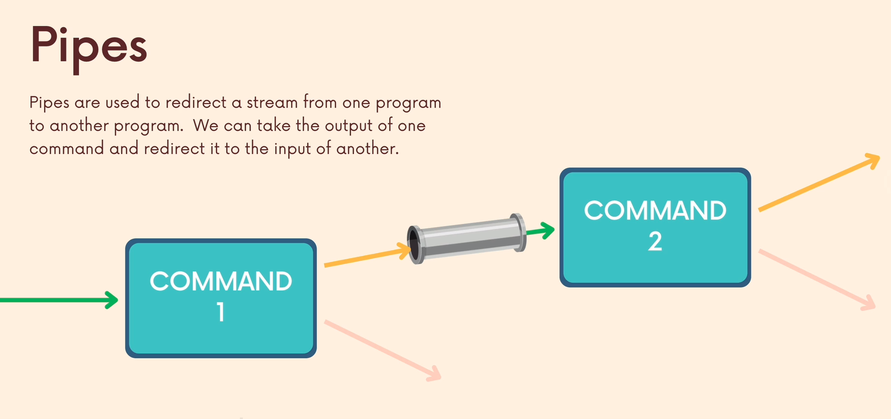

# Piping

### Important

-   Piping

### Useful

-   tee command

### Nice to have

-   tr command

## Introduction to Piping

Redirect the standard output of `COMMAND1` to the standard input of `COMMAND2`  
`COMMAND1 | COMMAND2`

Examples:  
`date | rev`  
`ls -l /usr/bin | less`  
`ls -/usr/bin | tail -n +2 | wc -l`

## Redirection vs Piping

Both `>` and `|` character are used to redirect output  
`>` redirects the stdout to some file  
`|` redirects the stdout to the stdin of the next command

## tr command

tr is used for find & replace, but it's not so powerful, the `sed` command is usually more suitable.

## Multiple pipes

Examples:

List the 3 largest files in the current directory  
`ls -lh | sort -rhk 5 | head -3`

> OBS: This is not the preferred way to find large files, use the `du` (disk usage) command instead.  
> `du -ha /usr/bin | sort -h | tail -4 | head -3`

## tee command

The tee program reads standard input and copies it both to standard output and to a file  
This allows us to capture information part of the way through a pipeline, without interrupting the flow

Example:  
`cat colors.txt words.txt | tee colorsAndWords.txt | wc -l`
