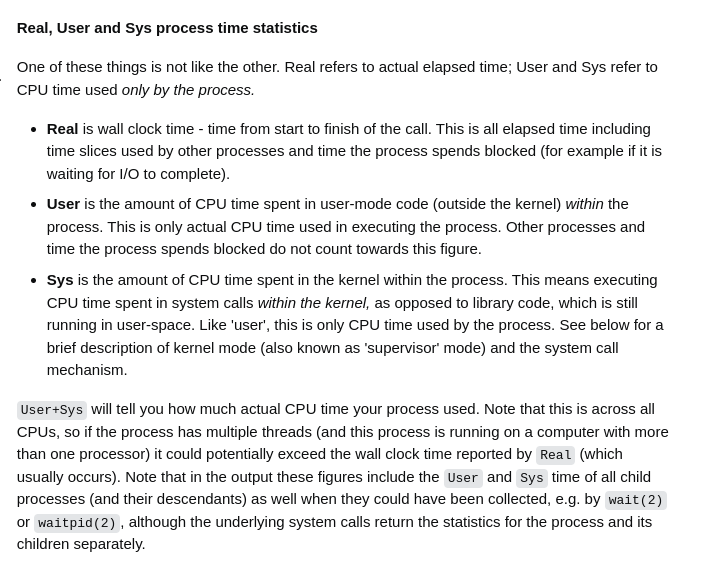

# Utils

> Useful commands

## Network

Show local ports in use  
`netstat -anp`

---

## Others

Open default file manager through terminal in current folder  
`xdg-open .`

---

Shows the time a process took to execute  
`time sleep 3`

---

