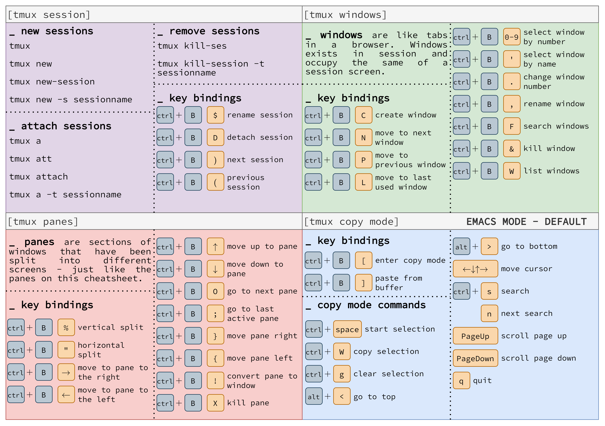

# Tmux

```bash
sudo apt install tmux
```

## Layers

Tmux has 3 layers:

-   Sessions
-   Windows
-   Panes

## Sessions

Show tmux sessions  
`tmux ls`

## Panes

Show panes indexes for navigation  
`ctrl-b q`

## Cheat Sheet


